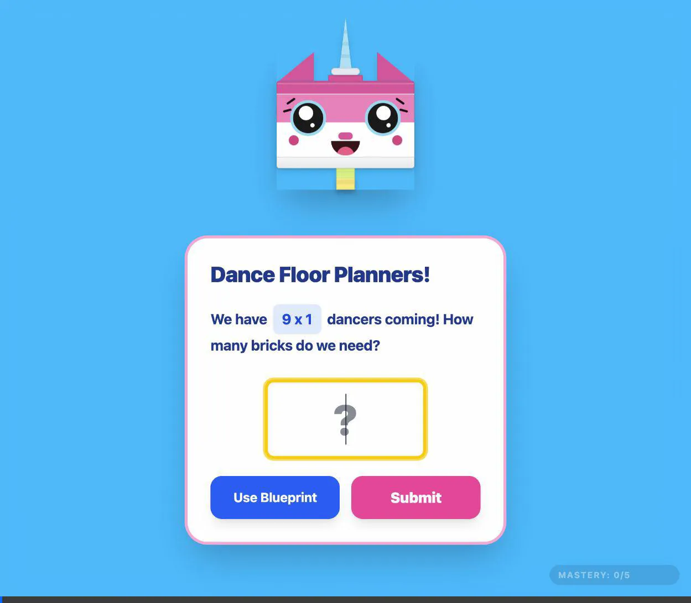
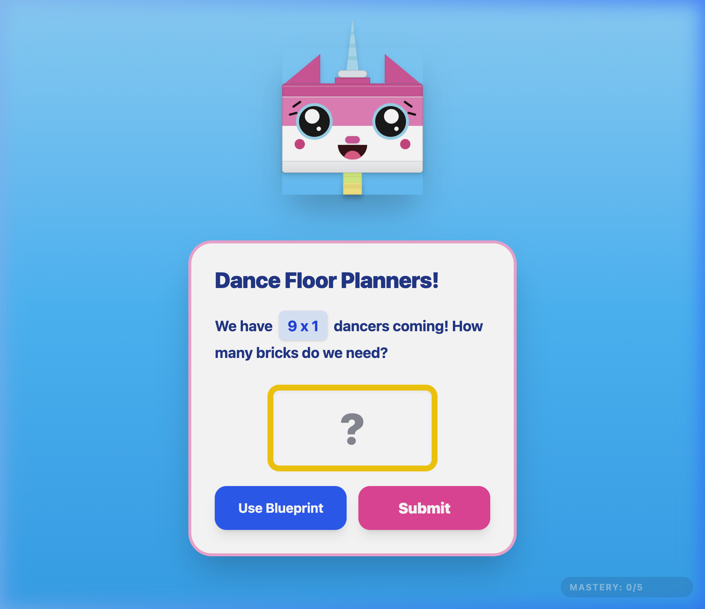
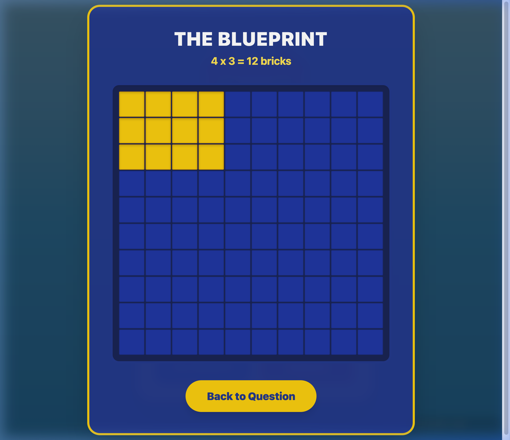
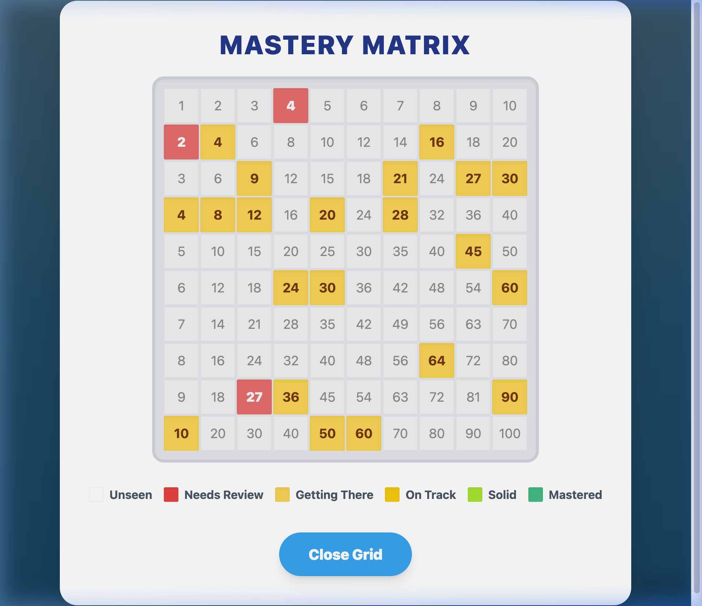
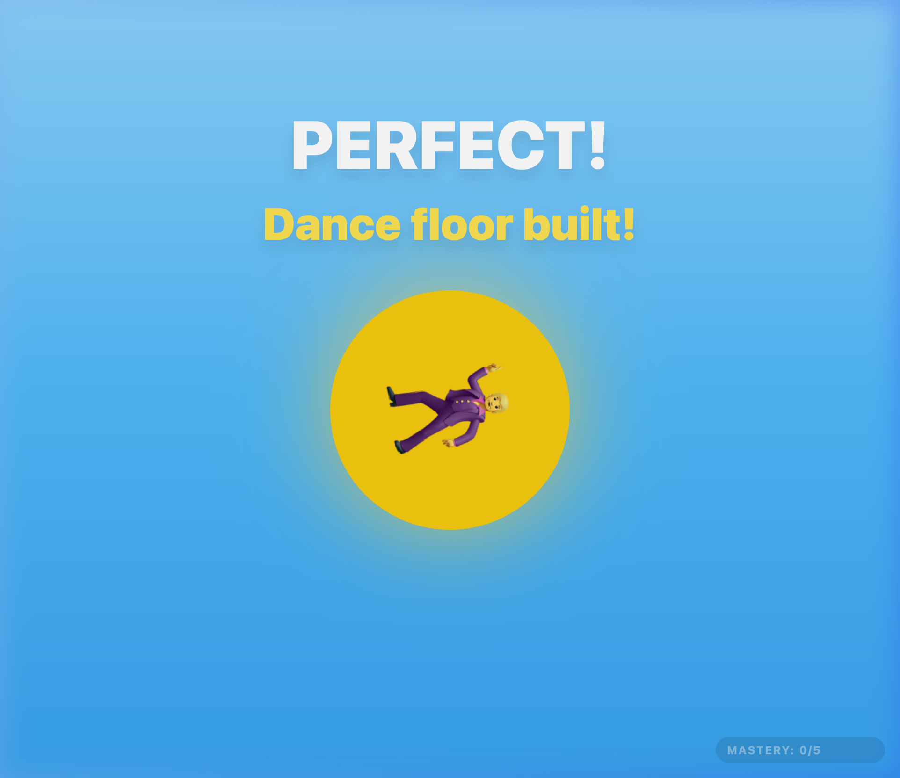

# Rainbows & Rage 🌈😡

A delightfully unhinged, dynamic React + Vite application explicitly designed to help kids learn their 1x1 to 10x10 multiplication tables through area models and spaced repetition!

---

## 🎮 The Game Loop

Rainbows & Rage features a hyper-energetic visual style built around two core emotional states depending on the student's mastery level for a specific math fact:

### Happy Mode (Standard)
For new facts or facts the student is successfully mastering. Featuring bright colors, bouncy animations, and an adorable Unikitty CSS character.

### Rage Mode (Emergency)
When a math fact is overdue and the student has a low mastery score, the UI undergoes an instant meltdown. The theme shifts to intense red/orange styling, and the character turns into "Angry Kitty", urgently demanding bricks to build the dance floor!

---

## 🛠 Features

### The Blueprint Tool
If a student gets stuck, they can use the **Blueprint**. This tool overlays a 10x10 CSS matrix matching the requested dimensions. Rather than just giving the answer, the student clicks and drags to highlight the exact dimensions (e.g. 6x4) and must rely on the visual block sizes to calculate the required area.

### The Mastery Matrix
Parents and teachers can discreetly click the "MASTERY" indicator button in the bottom right corner to pause the game and open the Mastery Grid overlay. This grid visualizes the exact score and proficiency for every single multiplication fact at a glance.

### Celebration Screen
When the student provides a correct answer—no matter what mode they were in—the tension clears and the dance floor is built successfully!

---

## 🧠 Technical Stack

- **React + Vite** for blazing fast local development
- **Tailwind CSS v4** for completely bespoke, single-file styling and keyframe animations
- **Browser LocalStorage** for local persistent spaced repetition tracking (no backend required!)
- **CSS Art:** The Unikitty avatar is 100% built using DOM nodes and Tailwind utilities—no raster images required outside of this README!
